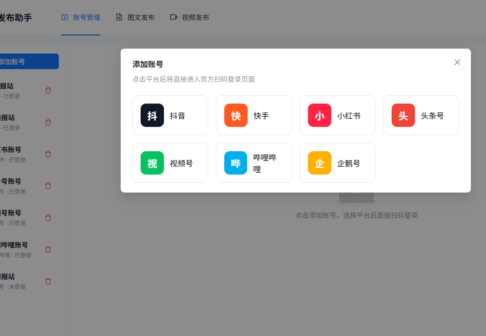
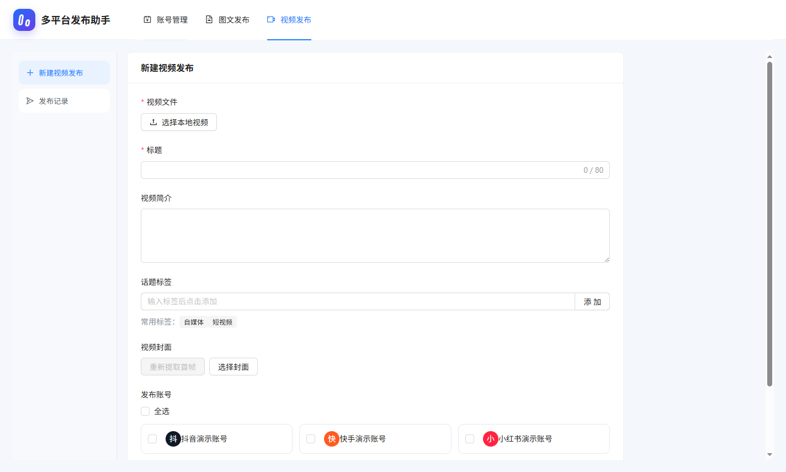
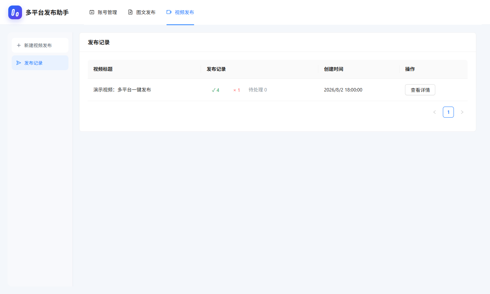
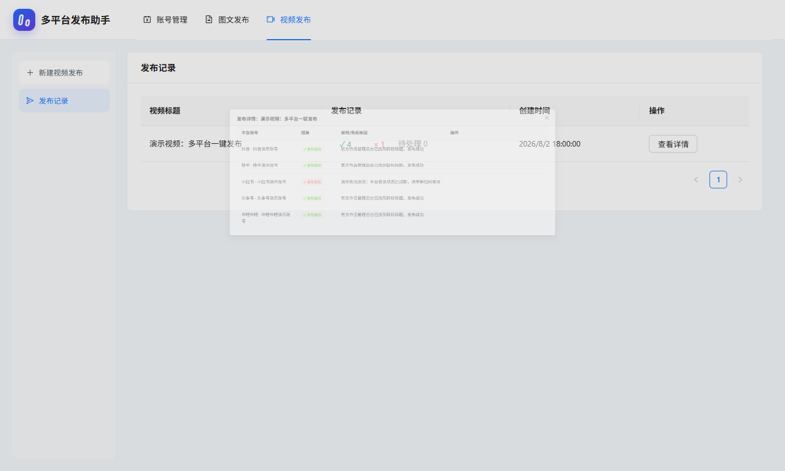

# MultiPublish

> 自媒体、短视频多平台一键发布工具。软件自身免注册、免登录、开箱即用，支持在 Windows 上统一管理抖音、快手、小红书、头条号、视频号、企鹅号和哔哩哔哩账号，并将同一个视频并发发布到多个平台。

网上能找到的同类开源项目通常维护不足或无法稳定使用，商业软件虽然功能完善，但长期订阅成本较高，因此开发了 MultiPublish。当前版本重点解决视频发布流程，已经使用多条视频进行真实发布验证；图文发布界面已经预留，但由于作者暂时没有图文发布需求，尚未进行完整实测。

> [!IMPORTANT]
> “免登录”是指 MultiPublish 软件本身不需要注册账号，也不需要购买会员。首次添加平台账号时，仍需在平台官方页面扫码登录。登录状态只保存在本机 Electron 浏览器会话中。

## 软件截图

### 账号管理



### 视频发布



### 发布记录



### 发布详情与失败原因



截图使用虚拟演示账号和虚拟发布数据生成，不包含真实账号、作品和本地文件路径；账号管理截图已包含视频号和企鹅号入口。

## 主要功能

- 一个客户端集中管理多个平台、多个账号。
- 点击账号即可打开对应平台的官方创作者后台。
- 通过平台官方扫码页面登录，不需要把账号密码交给软件。
- 选择本地视频后自动读取文件名作为标题和简介。
- 使用 FFmpeg 自动提取视频首帧作为封面，也可以手动选择封面。
- 支持标题、视频简介、话题标签和常用标签。
- 支持发布账号全选或按账号单独选择。
- 最多同时运行 3 个独立发布任务，在稳定性和发布速度之间取得平衡。
- 已成功的平台再次执行时自动跳过，避免重复发布。
- 发布记录分别显示成功、失败、处理中状态和失败原因。
- 只有在平台官方作品管理后台找到目标标题后，任务才会标记为成功。
- 自动发布失败时可以直接打开对应平台后台，手动检查或继续发布。

## 平台支持

| 平台 | 视频发布 | 官方后台 | 状态 |
| --- | --- | --- | --- |
| 抖音 | 支持 | 支持 | 已实测 |
| 快手 | 支持 | 支持 | 已实测 |
| 小红书 | 支持 | 支持 | 已实测 |
| 头条号 | 支持 | 支持 | 已实测 |
| 视频号 | 支持 | 支持 | 已适配 |
| 企鹅号 | 支持 | 支持 | 已适配 |
| 哔哩哔哩 | 支持 | 支持 | 已实测 |
| 图文发布 | 界面已预留 | - | 尚未完整测试 |

平台创作者后台会不定期调整页面结构。项目使用真实官方页面完成上传和发布，不调用来源不明的第三方接口；如果平台大幅改版，自动化流程可能需要同步适配。

## 下载与安装

1. 打开 GitHub 仓库右侧的 **Releases**。
2. 下载最新版本的 `MultiPublish-Setup-*.exe`。
3. 双击安装包，选择安装目录并完成安装。
4. 如果 Windows SmartScreen 提示未知发布者，请核对下载来源和 Release 中提供的 SHA-256 后再决定是否运行。
5. 升级版本前建议彻底退出 MultiPublish，包括任务栏和托盘中的后台进程，再覆盖安装。

当前程序仅针对 Windows 构建和测试。

## 使用方法

### 1. 添加平台账号

1. 打开 **账号管理**。
2. 点击 **添加账号**。
3. 选择抖音、快手、小红书、头条号或哔哩哔哩。
4. 软件会直接打开该平台官方登录页面。
5. 使用平台手机客户端扫码登录。
6. 登录完成后，软件会自动识别登录状态和账号名称。

每个账号使用独立的 Electron 持久化会话，平台 Cookie 和登录状态保存在本机，不会上传到 MultiPublish 的服务器，因为本项目本身没有账号服务器。

### 2. 创建视频发布任务

1. 进入 **视频发布 → 新建视频发布**。
2. 点击 **选择本地视频**。
3. 软件会根据视频文件名自动填写标题和简介，可继续手动修改。
4. 添加需要的话题标签。
5. 等待自动提取首帧封面，或者点击 **选择封面** 使用本地图片。
6. 勾选需要发布的平台账号，也可以使用 **全选**。
7. 点击 **一键发布**。

### 3. 查看发布结果

1. 进入 **视频发布 → 发布记录**。
2. 绿色数字表示发布成功的平台数量，红色数字表示失败数量。
3. 点击数字或 **查看详情**，可以查看每个平台的发布状态。
4. 失败记录会显示登录失效、平台校验、上传超时、控件变化等具体原因。
5. 必要时可返回账号管理，点击账号进入平台官方后台检查。

## 自动发布判定

MultiPublish 不会因为“点击了发布按钮”就直接报告成功。当前实现会在发布完成后进入平台官方作品管理后台，并搜索目标标题：

- 后台找到目标标题：标记为发布成功。
- 后台没有目标标题：标记为失败或需要人工检查。
- 遇到验证码、安全验证或登录失效：停止自动流程并提示用户处理。

这种判定方式会比只检查页面跳转更慢，但可以减少“软件显示成功、平台后台实际没有作品”的误报。

## 隐私与安全

- 软件自身不要求注册、登录或付费。
- 平台账号在各平台官方页面扫码登录。
- 登录 Cookie、账号信息、草稿和发布记录保存在当前 Windows 用户目录下。
- 默认数据目录：`%APPDATA%\multipublish`。
- 项目不会主动上传平台账号密码、Cookie 或本地视频。
- 请勿把 `%APPDATA%\multipublish` 目录、失败现场截图或带真实账号信息的日志上传到公开仓库。

### 数据恢复

程序保存数据时会先写入临时文件并刷新到磁盘，再替换正式文件，同时保留上一份有效备份。启动时如果发现正式文件损坏，会自动尝试备份或未完成临时文件，并把损坏文件改名为 `multipublish-data.json.corrupt-时间戳`，不会再用空数据覆盖原文件。

如果发生过恢复，软件启动后会显示恢复提示。诊断日志位于 Electron 日志目录中的 `multipublish-runtime.log`，可在提交 Issue 时一并提供经过隐私处理的日志。

## 常见问题

### 为什么提示登录失效？

平台 Cookie 可能过期，或者平台触发了安全校验。进入账号管理，打开对应账号并重新扫码登录。

### 为什么会提示找不到控件？

平台创作者后台是动态网页，页面结构、按钮文案和文件上传控件可能随时变化。请先确认使用最新版本，并在 Issue 中提供平台名称、错误信息和经过隐私处理的截图。

### 为什么发布速度不是五个平台完全同时完成？

程序默认最多同时运行 3 个独立发布任务。并发过高容易触发平台限流，也会显著增加内存占用，因此没有无限制同时打开所有平台。

### 图文发布可以使用吗？

界面和基础结构已经预留，但作者当前没有图文发布需求，因此未进行完整真实发布测试。欢迎提交适配和测试反馈。

## 本地开发

### 环境要求

- Windows 10 或 Windows 11
- Node.js 20 或更高版本
- npm

### 安装依赖

```powershell
npm install
```

### 启动开发环境

```powershell
npm run dev
```

### 类型检查

```powershell
npm run typecheck
```

### 构建程序

```powershell
npm run build
```

### 生成 Windows 安装包

```powershell
npm run dist
```

安装包默认生成在 `release` 目录中。

## 技术栈

- Electron
- React
- TypeScript
- Ant Design
- electron-vite
- FFmpeg
- Chrome DevTools Protocol

## 项目结构

```text
src/
├─ main/       Electron 主进程、账号会话、发布自动化、数据存储
├─ preload/    安全的渲染进程 IPC 接口
├─ renderer/   React 用户界面
└─ shared/     平台定义和共享类型
```

## 开源说明

本项目仍处于早期阶段，平台页面变化可能导致部分自动化流程暂时失效。欢迎提交 Issue 和 Pull Request，一起完善平台适配、错误诊断和图文发布功能。

使用本软件发布内容时，请遵守各平台用户协议、社区规范、版权政策和当地法律法规。请勿用于批量垃圾内容、绕过平台安全验证或其他违规用途。

## License

[MIT License](LICENSE)

